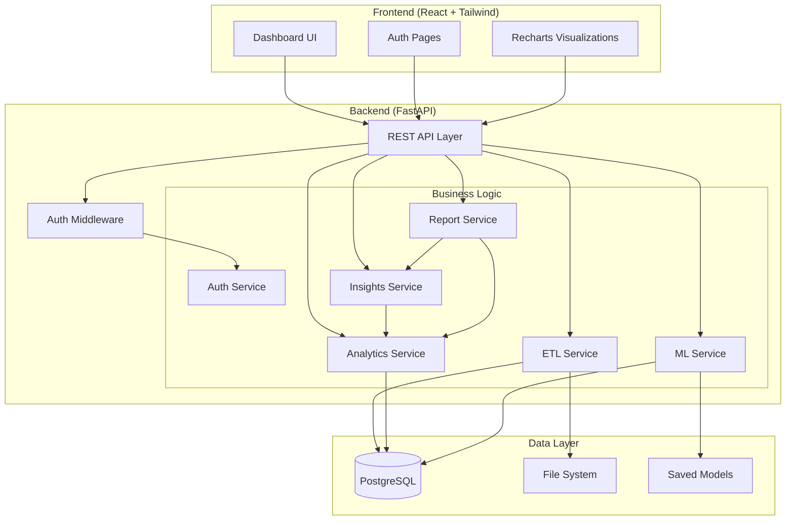
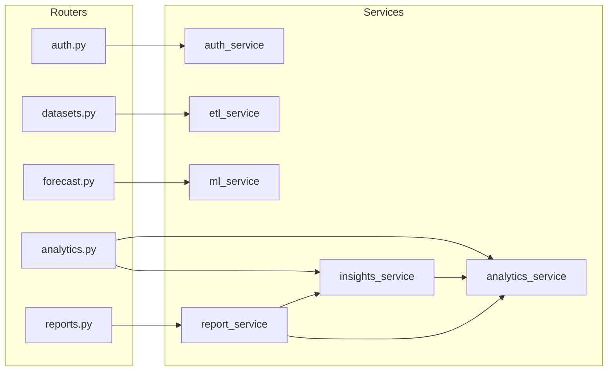
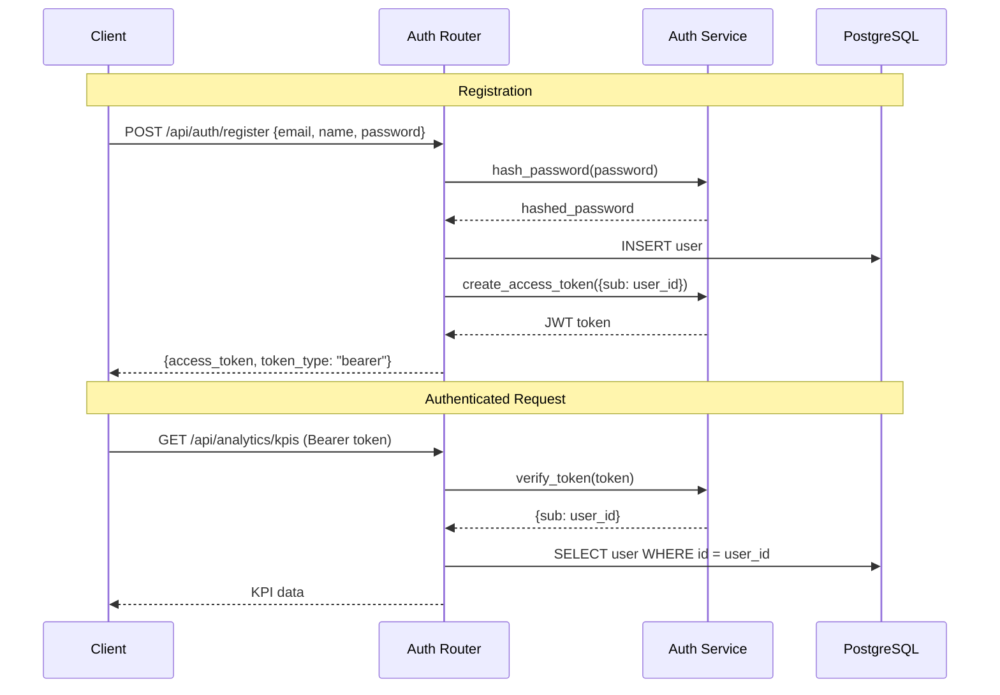

# System Architecture

## High-Level Overview



---

## Request Flow

### Typical API Request
```
Browser → Axios (with JWT) → FastAPI Router → Auth Middleware → Service Layer → Database → Response
```

### Data Upload Flow
```
CSV File → Upload Endpoint → Save to Disk → ETL Service
    ├── Validate Columns
    ├── Standardize Names  
    ├── Clean Data (remove duplicates, handle nulls)
    ├── Engineer Features (month, year, profit_margin, etc.)
    └── Bulk Insert → PostgreSQL
```

### ML Training Flow
```
Train Request → Query Sales Records → Feature Engineering
    ├── One-hot encode categoricals
    ├── Train/Test Split (80/20)
    ├── Fit Random Forest (100 trees, max_depth=15)
    ├── Evaluate (RMSE, MAE, R²)
    ├── Save Model (joblib)
    └── Store Results → PostgreSQL
```

---

## Architecture Decisions

### Why This Architecture?

This project uses a **layered architecture** with three clear layers:

1. **Routers** (API Layer) — Handle HTTP requests, validate input, return responses
2. **Services** (Business Logic) — Contain all business logic, SQL queries, ML training
3. **Models** (Data Layer) — Define database schema and relationships

This is the simplest architecture that separates concerns properly. Each layer has a single responsibility:

```
Router: "What data does the client want?"
Service: "How do I compute/fetch that data?"
Model: "What does the data look like in the database?"
```

### Why NOT Microservices?
- The entire application serves one domain (retail analytics)
- A single PostgreSQL database is sufficient
- Microservices add network overhead, deployment complexity, and distributed system challenges
- For ~5000 rows of data, a monolith is the right choice

### Why NOT Repository Pattern?
- SQLAlchemy already provides a data access abstraction
- Adding repositories creates an unnecessary layer between services and the ORM
- Direct SQLAlchemy queries in services are readable and maintainable at this scale

### Why Static Methods in Services?
- Services don't hold state — they transform inputs and return outputs
- Static methods make this explicit: no hidden instance variables
- Easy to test: pass dependencies (db session) as parameters

---

## Component Interactions



**Key dependency**: `insights_service` depends on `analytics_service` (it uses analytics data to generate insights). `report_service` depends on both `analytics_service` and `insights_service`.

---

## Authentication Flow



---

## Frontend Architecture

```
App.jsx (Router)
├── Login.jsx (public)
├── Register.jsx (public)
└── ProtectedRoute → Layout
    ├── Sidebar (navigation)
    ├── Navbar (user info, logout)
    └── Page Content
        ├── Dashboard (KPIs + charts)
        ├── Datasets (upload + manage)
        ├── Analytics (detailed charts)
        ├── Forecast (ML results)
        ├── Insights (business recommendations)
        ├── Reports (generate + download)
        └── Profile (user info)
```

**State Management**: React Context for auth state only. All other data is fetched per-page using `useState` + `useEffect`. No global state management library (Redux) — each page manages its own data lifecycle.

**Why no Redux?**
- Each page fetches its own data independently
- There's no shared state between pages that needs synchronization
- React Context handles the only cross-cutting concern (auth)
- Adding Redux would introduce boilerplate without solving a real problem

---

## Data Flow Summary

| User Action | Frontend | API Endpoint | Service | Database |
|-------------|----------|-------------|---------|----------|
| Login | Auth form | POST /auth/login | auth_service | users |
| Upload CSV | FileUpload | POST /datasets/upload | etl_service | datasets, sales_records |
| View Dashboard | Dashboard page | GET /analytics/* | analytics_service | sales_records |
| Train Model | Forecast page | POST /forecast/train | ml_service | sales_records, forecast_results |
| Get Insights | Insights page | GET /analytics/insights | insights_service → analytics_service | sales_records |
| Download Report | Reports page | GET /reports/{id}/download | report_service | saved_reports |
