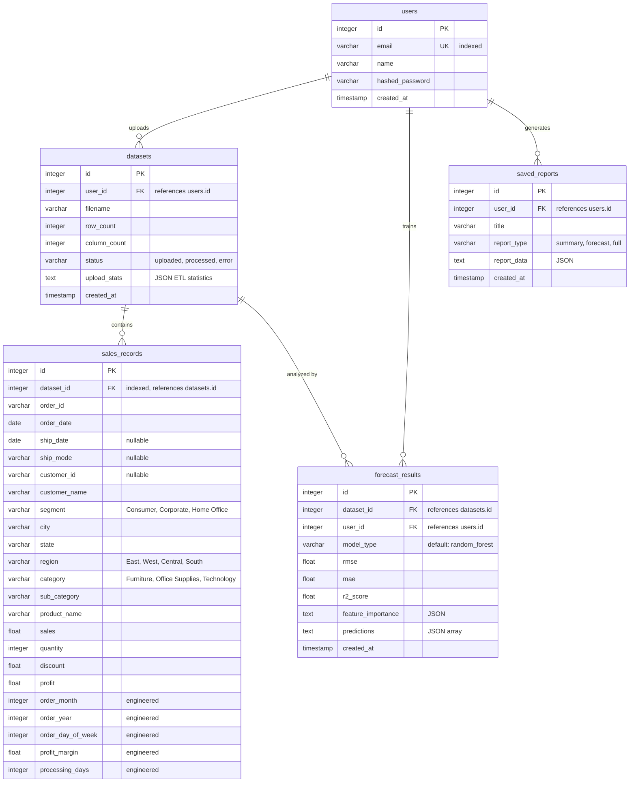

# Database Design

## Overview

The database uses PostgreSQL with 5 tables in a normalized schema optimized for both transactional operations (CRUD) and analytical queries (aggregations, grouping).

---

## ER Diagram

---

## Table Details

### users
Stores registered user accounts. Email is unique and indexed for fast login lookups.

| Column | Type | Constraints | Notes |
|--------|------|------------|-------|
| id | INTEGER | PK, AUTO | |
| email | VARCHAR(255) | UNIQUE, NOT NULL, INDEX | Used for login |
| name | VARCHAR(255) | NOT NULL | Display name |
| hashed_password | VARCHAR(255) | NOT NULL | bcrypt hash |
| created_at | TIMESTAMP | DEFAULT now() | Registration time |

### datasets
Metadata about uploaded CSV files. Linked to the uploading user.

| Column | Type | Constraints | Notes |
|--------|------|------------|-------|
| id | INTEGER | PK, AUTO | |
| user_id | INTEGER | FK → users.id | Dataset owner |
| filename | VARCHAR(255) | | Original filename |
| row_count | INTEGER | | Rows after cleaning |
| column_count | INTEGER | | Columns in dataset |
| status | VARCHAR(50) | DEFAULT 'processed' | Upload status |
| upload_stats | TEXT | NULLABLE | JSON with ETL stats |
| created_at | TIMESTAMP | DEFAULT now() | |

### sales_records
The core analytical table. Each row is one line item from a sales order. This table is queried by all analytics endpoints.

**Why store individual records instead of pre-aggregated data?**
Pre-aggregation limits query flexibility. By storing raw records, we can slice data by any combination of dimensions (region + category + time period) without maintaining separate summary tables.

**Engineered features** (added during ETL):
- `order_month`, `order_year`, `order_day_of_week` — Extracted from `order_date` for time-based grouping without runtime date parsing
- `profit_margin` — Pre-calculated as `(profit / sales) * 100` for quick margin analysis
- `processing_days` — `ship_date - order_date` in days, useful for fulfillment analysis

**Index**: `dataset_id` is indexed because nearly every analytics query filters by dataset.

### forecast_results
Stores ML model evaluation results. `feature_importance` and `predictions` are stored as JSON text since their structure varies and they're read as-is (not queried against).

### saved_reports
Stores generated reports as JSON blobs. The report_data field contains the assembled analytics, insights, and forecasts at the time of generation — a snapshot that won't change even if new data is uploaded.

---

## Indexing Strategy

| Table | Column | Index Type | Reason |
|-------|--------|-----------|--------|
| users | email | UNIQUE B-tree | Fast login lookup |
| sales_records | dataset_id | B-tree | All analytics filter by dataset |
| datasets | user_id | Implicit FK | List user's datasets |

**Why not more indexes?**
For a dataset of ~5,000 rows, additional indexes on columns like `region`, `category`, or `order_date` provide minimal benefit. PostgreSQL's sequential scan is fast enough at this scale. If the dataset grows to 100K+ rows, consider adding composite indexes on `(dataset_id, category)` and `(dataset_id, order_year, order_month)`.

---

## Normalization Notes

The schema is mostly in **3NF** (Third Normal Form):
- No repeating groups (1NF ✓)
- All non-key columns depend on the full primary key (2NF ✓)
- No transitive dependencies between non-key columns (3NF ✓)

**Deliberate denormalization**: Customer name, city, state, and region are stored directly in `sales_records` rather than in a separate `customers` table. This simplifies analytics queries (no JOINs needed) and matches how retail data typically arrives in CSV exports.

---

## Why PostgreSQL?

1. **Strong SQL support**: Window functions, CTEs, and complex aggregations needed for analytics
2. **ACID compliance**: Data integrity for financial data (sales, profit)
3. **Scalability**: Handles millions of rows when needed
4. **Industry standard**: Most analytics teams use PostgreSQL or similar RDBMS
5. **JSON support**: `TEXT` fields with JSON work fine for our needs; `JSONB` available if we need to query inside JSON later
